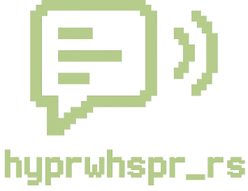

<div align="center">
  
  <h3>hyprwhspr-rs</h3>
  <p>Rust implementation of <a href="https://github.com/goodroot/hyprwhspr">hyprwhspr</a> | Native speech-to-text voice dictation for Hyprland.</p>
</div>
<hr />

> ⚠️ **Experimental:** This application is largely written with AI.

## Requirements

- whisper.cpp ([GitHub](https://github.com/ggml-org/whisper.cpp), [AUR](https://aur.archlinux.org/packages/whisper.cpp))
- Groq or Gemini API key (optional)
  - Groq is cheap and fast as hell. Advanced/pretty formatting not included.
  - Slow, but much better output formatting.

## Features

- Fast speech-to-text
- Intuitive configuration
  - word overrides
  - multi provider support
  - hot reloading during runtime

## Built for Hyprland

- Detects Hyprland via `HYPRLAND_INSTANCE_SIGNATURE` and opens the IPC socket at `$XDG_RUNTIME_DIR/hypr/<signature>/.socket.sock`.
- Execs `dispatch sendshortcut` commands against the active window to paste dictated text, inspecting `activewindow` to decide when `Shift` is required for a hardcoded list of programs.
- Falls back to a Wayland virtual keyboard client or a simulated keypress paste if IPC communication fails.

## Development

1. `git clone https://github.com/better-slop/hyprwhispr-rs.git`
2. `cd hyprwhspr-rs`
3. `cargo build --release`
4. Run using:
    - pretty logs: `RUST_LOG=debug ./target/release/hyprwhspr-rs`
    - production release: `./target/release/hyprwhspr-rs`

<details>
  <summary><strong>Example <code>~/.config/hyprwhspr-rs/config.jsonc</code></strong></summary>

```jsonc
{
  "shortcuts": {
    "press": "SUPER+ALT+D",
    "hold": "SUPER+ALT+CTRL",
  },
  "word_overrides": {
    "under score": "_",
    "em dash": "—",
    "equal": "=",
    "at sign": "@",
    "pound": "#",
    "hashtag": "#",
    "hash tag": "#",
    "newline": "\n",
    "Omarkey": "Omarchy",
    "dot": ".",
    "Hyperland": "hyprland",
    "hyperland": "hyprland",
  },
  "audio_feedback": true, // Play start/stop sounds while recording
  "start_sound_volume": 0.1, // 0.1 - 1.0
  "stop_sound_volume": 0.1, // 0.1 - 1.0
  "start_sound_path": null, // Optional custom audio asset overrides
  "stop_sound_path": null, // Optional custom audio asset overrides
  "auto_copy_clipboard": true, // Automatically copy the final transcription to the clipboard
  "shift_paste": false, // Whether to force shift paste
  "paste_hints": {
    "shift": [
      // Optional list of Hyprland window classes that should always paste with Ctrl+Shift+V
    ]
  },
  "audio_device": null, // Force a specific input device index (null uses system default)
  "vad": {
    "enabled": false, // Toggles Silero VAD inside whisper.cpp
    "model": "ggml-silero-v5.1.2.bin", // Path or filename for the ggml Silero VAD model (ggml-silero-v5.1.2.bin)
    // Probability threshold for deciding a frame is speech. Higher = fewer false positives, but may miss quiet speech.
    "threshold": 0.5,
    // Minimum contiguous speech duration (ms) to accept. Increase to ignore quick clicks/taps.
    "min_speech_ms": 250,
    // Minimum silence gap (ms) required to end a speech segment. Raise if mid-sentence pauses are being split.
    "min_silence_ms": 120,
    // Maximum speech duration (seconds) before forcing a cut. Use Infinity to leave unlimited.
    "max_speech_s": 15.0,
    // Extra padding (ms) added before/after detected speech so words aren't clipped.
    "speech_pad_ms": 80,
    // Overlap ratio between segments (seconds). Higher overlap helps smooth transitions at the cost of a little extra decode time.
    "samples_overlap": 0.1,
  },
  "transcription": {
    "provider": "whisper_cpp", // whisper_cpp | groq | gemini
    "request_timeout_secs": 45,
    "max_retries": 2,
    "whisper_cpp": {
      "prompt": "Transcribe as technical documentation with proper capitalization, acronyms, and technical terminology. Do not add punctuation.",
      "model": "large-v3-turbo-q8_0", // Whisper model to use (must exist in specified directories)
      "threads": 4, // CPU threads dedicated to whisper.cpp
      "gpu_layers": 999, // Number of layers to keep on GPU (999 = auto/GPU preferred)
      "fallback_cli": false, // Fallback to whisper-cli (uses CPU)
      "no_speech_threshold": 0.6, // Whisper's "no speech" confidence gate
      "models_dirs": [
        "~/.config/hyprwhspr-rs/models"
      ] // Directories to search for models
    },
    "groq": {
      "model": "whisper-large-v3-turbo",
      "endpoint": "https://api.groq.com/openai/v1/audio/transcriptions",
      "prompt": "Transcribe as technical documentation with proper capitalization, acronyms, and technical terminology. Do not add punctuation."
    },
    "gemini": {
      "model": "gemini-2.5-flash-preview-09-2025",
      "endpoint": "https://generativelanguage.googleapis.com/v1beta/models",
      "temperature": 0.0,
      "max_output_tokens": 1024,
      "prompt": "Transcribe as technical documentation with proper capitalization, acronyms, and technical terminology. Do not add punctuation."
    }
  }
}
```

</details>

## Release Process

Releases are tag-driven and automated by GitHub Actions. Runtime builds continue to rely on a local `whisper.cpp` installation, so validate that dependency before shipping a version.

1. Install the tooling once: `cargo install cargo-release git-cliff`.
2. For prereleases run `cargo release --no-dev-version --pre-release alpha` (append `--execute` when ready to push). This updates the changelog, creates the tag (`vX.Y.Z-alpha.N`), and prepares artifacts.
3. Push with `git push --follow-tags`. The `release` workflow builds the binary, publishes the GitHub prerelease, and attaches the tarball plus checksum.
4. When stabilizing, run `cargo release --execute` to cut, tag, and push the final version. The same workflow publishes the crate to crates.io because stable tags omit the prerelease suffix.

> Define `CRATES_IO_TOKEN` in the repository secrets with publish-only permissions so the workflow can push stable releases to crates.io.

## To Do

- [ ] Slop review/clean up
- [ ] Ship waybar integration (`hyprwhspr-rs --waybar`)
- [ ] Release on Cargo
- [ ] Release on AUR
- [ ] Add support for other operating systems/setups
- [ ] Refine paste layer
- [ ] Investigate formatting model
